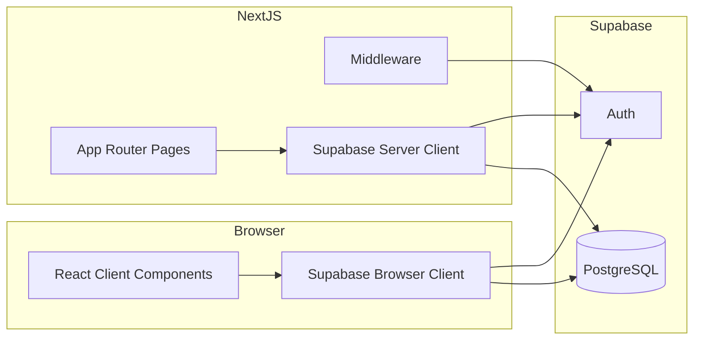

# Arquitectura

## Visión general

Gestio es una aplicación **full-stack** donde el frontend y las API routes viven en Next.js, y la persistencia y autenticación se delegan a **Supabase**.



## Capas

### 1. Presentación (`src/app`, `src/components`)

- **App Router** con grupos de rutas:
  - `(auth)`: pantallas sin layout de dashboard.
  - `(dashboard)`: comparten `layout.tsx` con sidebar y header.
- La mayoría de páginas con lógica de formulario son **Client Components** (`"use client"`).
- Estilos con **Tailwind CSS** y fuentes locales Geist.

### 2. Integración Supabase (`src/lib/supabase`)

| Archivo | Uso |
|---------|-----|
| `client.ts` | `createBrowserClient` — formularios, acciones en el navegador |
| `server.ts` | `createServerClient` con cookies de Next.js — Server Components y acciones futuras |

Ambos leen `NEXT_PUBLIC_SUPABASE_URL` y `NEXT_PUBLIC_SUPABASE_ANON_KEY`.

### 3. Middleware (`src/middleware.ts`)

- Intercepta peticiones a `/dashboard` y `/dashboard/*`.
- Crea un cliente Supabase con cookies de la petición.
- Si no hay usuario autenticado, redirige a `/login`.
- Devuelve la respuesta con cookies actualizadas (refresh de sesión SSR).

**Limitación actual:** rutas como `/clientes`, `/servicios` y `/facturacion` **no** están en el `matcher` del middleware. Solo `/dashboard` exige sesión. Ampliar el matcher es recomendable antes de producción.

```typescript
// matcher actual
matcher: ["/dashboard", "/dashboard/:path*"]
```

### 4. Configuración Next.js

`next.config.mjs` define `Cache-Control: no-store` en todas las rutas para evitar caché agresiva en entornos con datos de usuario.

## Flujos principales

### Registro

1. `signUp` en Supabase Auth (email + contraseña).
2. Inserción en `profiles` con `user_id`, nombre, empresa, teléfono y `plan: "free"`.
3. Redirección a `/login`.

### Login

1. `signInWithPassword`.
2. Redirección a `/dashboard`.

### Crear cliente

1. `getUser()` para obtener el usuario de sesión.
2. Consulta `profiles` por `user_id` para obtener `profile_id`.
3. `insert` en `clients` con nombre, email, teléfono y notas.
4. Los **campos personalizados** (`FieldTemp`) se gestionan en estado local; aún no se persisten en base de datos.

## Convenciones de código

- Alias de importación: `@/*` → `src/*` (ver `tsconfig.json`).
- Componentes de formulario reciben estado y setters por props (patrón controlado).
- Tipos compartidos de campos temporales en `modal_filed.tsx` (`FieldTemp`).

## Dependencias clave

| Paquete | Rol |
|---------|-----|
| `@supabase/ssr` | Cliente compatible con cookies en Next.js |
| `@tabler/icons-react` | Iconografía del sidebar |
| `papaparse` | Parseo CSV (importación futura) |
| `recharts` | Gráficos del dashboard (futuro) |

## Despliegue

Compatible con [Vercel](https://vercel.com/) u otro host Node.js. Configura las mismas variables de entorno en el panel del proveedor. Asegura que las URLs de redirección de Supabase Auth incluyan el dominio de producción.
