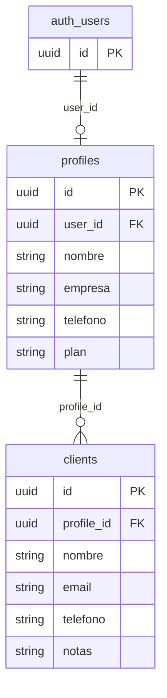

# Base de datos (Supabase)

El esquema no está versionado en el repositorio; esta documentación se infiere del uso en el código. Debes crear las tablas y políticas **RLS** en el panel de Supabase o mediante migraciones SQL.

## Diagrama de relaciones



## Tabla `profiles`

Creada al registrarse un usuario. Vincula la cuenta de Auth con el perfil de negocio.

| Columna | Tipo (sugerido) | Origen en código |
|---------|-----------------|------------------|
| `id` | `uuid` PK, default `gen_random_uuid()` | Referenciado como FK en `clients` |
| `user_id` | `uuid` FK → `auth.users.id` | `registro/page.tsx` |
| `nombre` | `text` | Formulario de registro |
| `empresa` | `text` nullable | Formulario de registro |
| `telefono` | `text` nullable | Formulario de registro |
| `plan` | `text` default `'free'` | Valor fijo `"free"` en registro |

### Ejemplo de inserción (registro)

```typescript
await supabase.from("profiles").insert([{
  user_id: data.user.id,
  nombre,
  empresa,
  telefono,
  plan: "free",
}]);
```

## Tabla `clients`

Clientes pertenecientes a un perfil (tenant implícito por `profile_id`).

| Columna | Tipo (sugerido) | Origen en código |
|---------|-----------------|------------------|
| `id` | `uuid` PK | — |
| `profile_id` | `uuid` FK → `profiles.id` | `clientes/nuevo/page.tsx` |
| `nombre` | `text` | Formulario |
| `email` | `text` nullable | Formulario |
| `telefono` | `text` nullable | Formulario |
| `notas` | `text` nullable | Formulario |

### Ejemplo de inserción (nuevo cliente)

```typescript
const { data: profile } = await supabase
  .from("profiles")
  .select("id")
  .eq("user_id", user.id)
  .single();

await supabase.from("clients").insert([{
  profile_id: profile.id,
  nombre,
  email,
  telefono,
  notas,
}]);
```

## SQL de referencia (creación inicial)

Ajusta tipos y políticas según tus necesidades de seguridad.

```sql
-- Perfiles de usuario
create table public.profiles (
  id uuid primary key default gen_random_uuid(),
  user_id uuid not null unique references auth.users (id) on delete cascade,
  nombre text not null,
  empresa text,
  telefono text,
  plan text not null default 'free',
  created_at timestamptz default now()
);

-- Clientes
create table public.clients (
  id uuid primary key default gen_random_uuid(),
  profile_id uuid not null references public.profiles (id) on delete cascade,
  nombre text not null,
  email text,
  telefono text,
  notas text,
  created_at timestamptz default now()
);

-- Índices útiles
create index clients_profile_id_idx on public.clients (profile_id);

-- RLS (ejemplo mínimo: cada usuario solo ve su perfil y sus clientes)
alter table public.profiles enable row level security;
alter table public.clients enable row level security;

create policy "profiles_select_own" on public.profiles
  for select using (auth.uid() = user_id);

create policy "profiles_insert_own" on public.profiles
  for insert with check (auth.uid() = user_id);

create policy "clients_all_own" on public.clients
  for all using (
    profile_id in (
      select id from public.profiles where user_id = auth.uid()
    )
  );
```

## Extensiones futuras (no implementadas)

El UI de **campos personalizados** (`FieldTemp`: nombre, tipo, requerido, valor) sugiere tablas adicionales, por ejemplo:

- `custom_fields` — definición de columnas por `profile_id`
- `client_field_values` — valores por cliente y campo

La dependencia **PapaParse** anticipa importación CSV hacia `clients` (y posiblemente valores de campos custom).

## Auth

- Proveedor: email + contraseña (`signUp`, `signInWithPassword`).
- Tras el registro, Supabase puede exigir confirmación de email según la configuración del proyecto.
- La contraseña debe tener al menos 8 caracteres (validación en cliente en `registro/page.tsx`).
